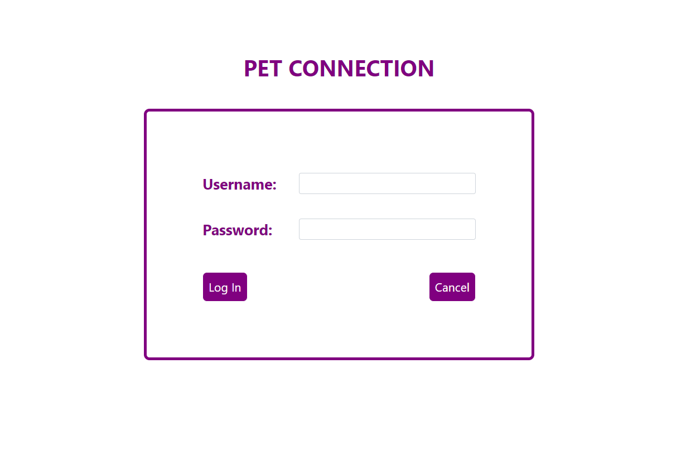
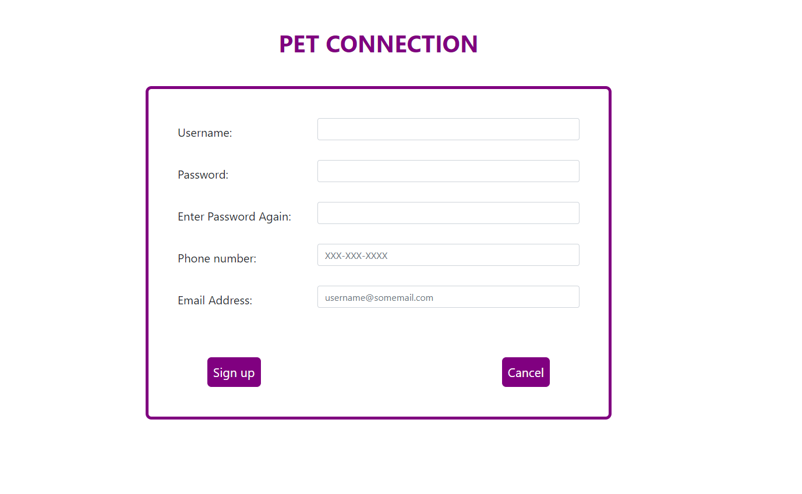
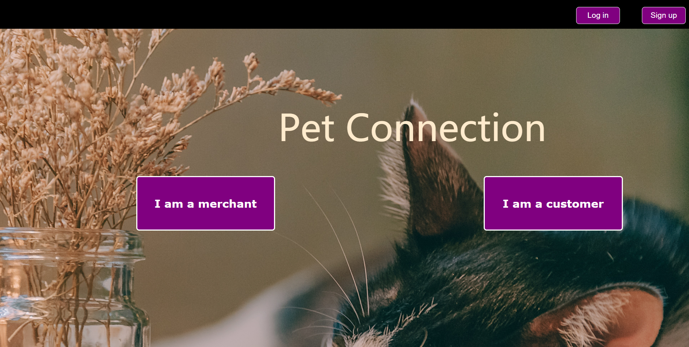
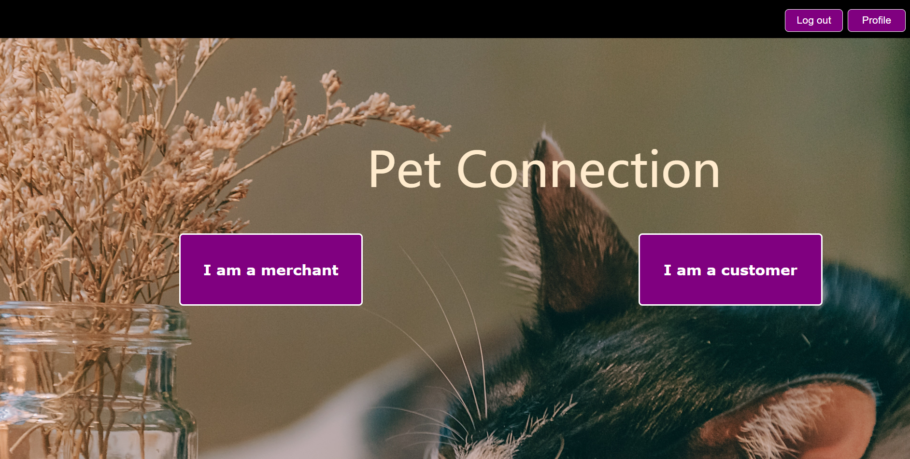
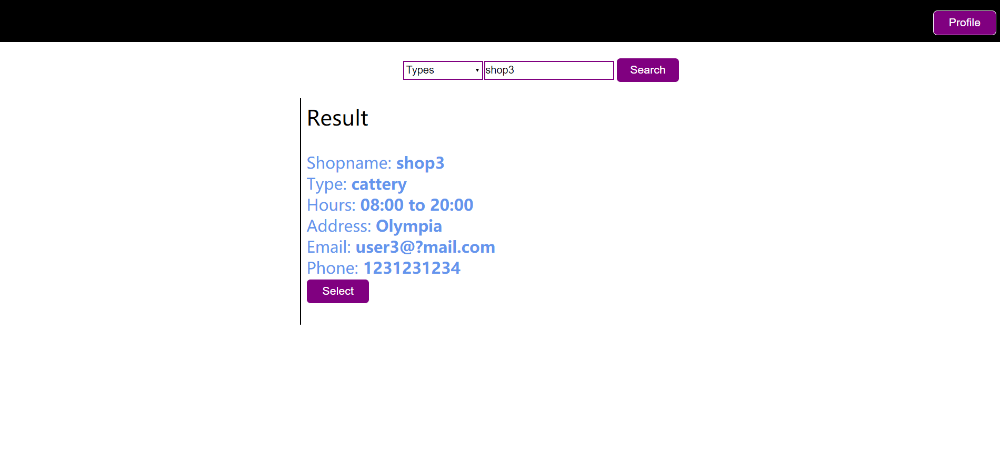
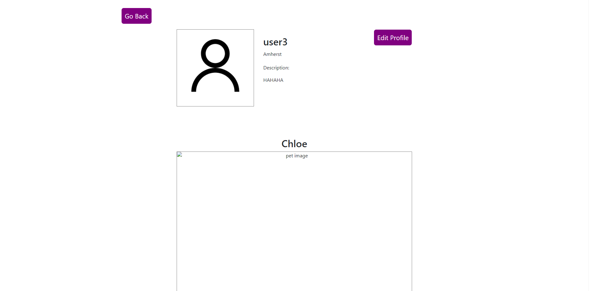
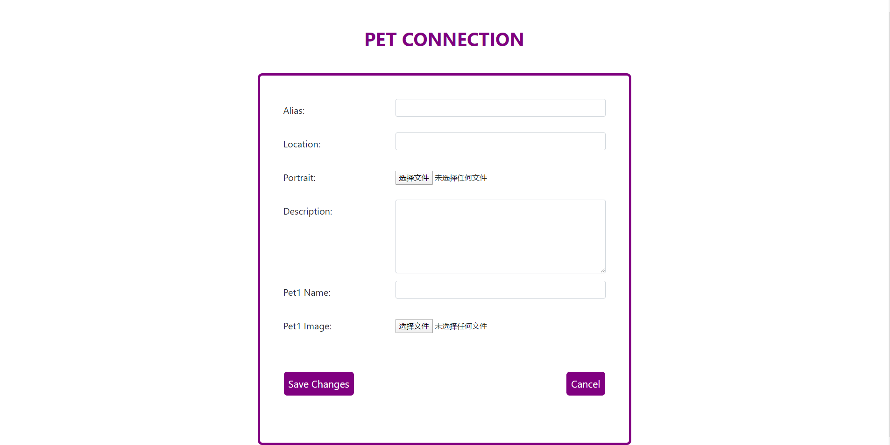
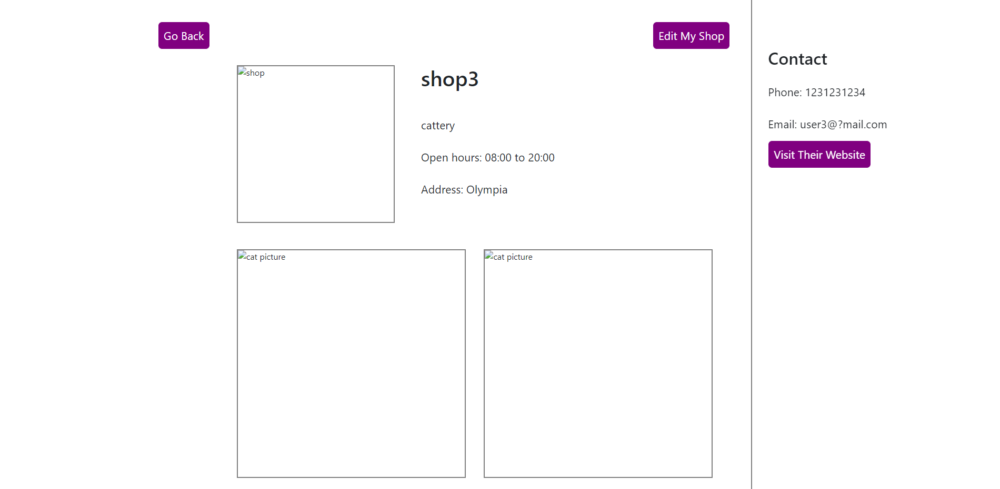
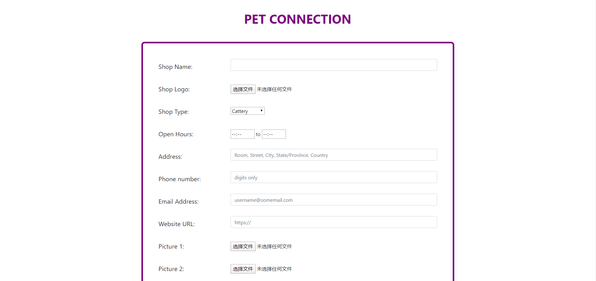

# Team: Dalet
# Application:  Pet Connection
# Semester: Spring 2020
# Team Members
Name: Chuyang Zhong  
Github: z175886   
Name: Zhongdong Yu  
Github: Zhongdong-Siege   
Name: Zhou Xie  
Github: Cishard

# Overview
This website is made for pet owners and pet-related practitioners, gathering the infomation of pet shops, hospitals and toy shops, and providing filter functions by shop type and name. Typically, if people want to buy pets, they needs to search pet shops on google and look at these websites one by one. With the help of our application, they can find their desired pets more conveniently.

#User Interface
Log in

Sign up

Homepage before log in

Homepage after log in

Customer Search Page

Personal Profile

If the user does not manage a shop, then it shows

Personal Prodile Edit Page

Shop

Shop Edit Page

#API
/log_in : allows user to log in.

/sign_up : allows user to sign up.

/search : allows user to search shops.

/profile : shows user's personal profile.

/profile_edit : allows user to edit his/her personal profile.

/shop : shows a shop's webpage.

/shop_edit : allows user to create or edit his/her own shop.

/shop_delete : allows user to delete his/her own shop.

#Database
**User's Collection** 
username | string 
password | string 
phone | string 
email | string 
shop\_index | string | Name of the shop managed by user 
activity\_array | Array<string> | Array of activities the user joined 
alias | string 
portrait\_src | any | Portrait image 
location | string | The place user lives in 
description | string | user's self-introducton 
pet1\_name | string | user's first pet's name 
pet2\_name | string | user's second pet's name 
pet1\_src | any | user's first pet's image 
pet2\_src | any | user's second pet's image 

**Shop's Collection** 
owner | string | username of the shop owner 
name | string | shop name 
type | string 
open\_hour | string 
address | string 
phone | string 
email | string 
url | string| The merchant's own website 
logo\_src | any | Logo Image 
pic1\_src | any 
pic2\_src | any 
pic3\_src | any 
pic4\_src | any 

#URL Routes
**userNotFoundHandler** 
seaches the input username from database, and returns error message if username is not found.

**passwordIncorrectHandler** 
compares the input password with the correct password in database. If they are identical, then allow user to log in.

**logInHandler** 
saves username in local storage, and help user log in.

**signUpErrorHandler** 
helps user sign up. It will check whether the two passwords are identical, and whether the username has been registered.

**signUpHandler** 
helps user sign up, and puts the input data to database.

**readProfileHandler** 
gets the user's infomation, and sends these data to local storage.

**editProfileHandler** 
allows user to edit alias, location, description, pictures and other personal infomation.

**shopNotFoundHandler** 
seaches the input shop name from database, and returns error message if shop name is not found.

**viewShopHandler** 
get shop's infomation, and sends these data to local storage.

**editShopErrorHandler** 
checks whether the user gives an empty shop name, open hour, address, or phone number, and whether the shop name has been registered.

**editShopHandler** 
allows user to edit his/her shop name, open hour, address, and other infomation, and puts the input data to database.

**deleteShopHandler** 
allows user to close his/her own shop.

**shopNotMatchHandler** 
searches the shop from database by its name or type, sends error message if no shop matches the input.

**viewSearchResultHandler** 
searchs the shop from database by its name or type, sends these data to local storage.

#Authentication
When the user is not logged in, we ban all the functionalities for him/her except log in or sign up. The user can only access his/her own profile because we haven't implemented function to allow users to read others' profiles yet. The "Edit My Shop" button only shows when it is viewed by its owner.

#Division of Labor
**Chuyang Zhong**

HTML/CSS:

- homepage
- customer search page

Front-end Implemention:

- homepage
- customer search page

Back-end Implemention:

- homepage
- customer search page

Mongo Database Cluster

**Zhongdong Yu**

HTML/CSS:

- log in/ sign up
- personal profile
- shop

Front-end Implemention:

- log in/ sign up
- personal profile
- shop (create/delete)

Back-end Implemention:

- log in/ sign up
- personal profile

Heroku Delpoyment

Skeleton Codes and node_modules Set up

**Zhou Xie**

Front-end Implemention:

- shop (read/update)

Back-end Implemention:

- shop (create/read/update/delete)

Markdown Files

#Conclusion
We learnt many things from this course because webpage programming was brand new to all of us, and we enjoyed the process for most of the time. We've been met a lot of difficulties, such as:

- how to use bootstrap
- how to send data between htmls without using form
- how to let users upload images
- how to use findMany function of mongodb
- how to deploy on heroku

Sadly, we still didn't figure out how to process the images uploaded by users, and we couldn't ensure the security of users' secrets. We designed many functions at beginning, such as allowing users to post activities and allowing them to rate and comment shops, but we finally decided to remove these functionalities because we didn't have enough time on them. These things are the most regrettable part.

I think the most important lession we learnt from this project is not to write too many codes at once before testing the functionality. When we are implementing the back-end things, we built functions with tens of parameters and implemented every routes before doing any test on them. Since it was not easy to debug on javascript and website, we spent a lot of time on debugging and finally we had to get rid of some functionalities.