# Innovative Idea
We plan to make a website for pet owners and pet-related practitioners, gathering the information of pet shops, hospitals, parties and any other service or activity, and providing filter, rating, and comment functions.

# Important Components
Users can write description and upload images on their profile. 

For pet services, the practitioners posts their opening time, location, contact info, service type, and description, along with a link to their own website. 

For pet-related activities, the host first posts the time, location, contact info, pet species, and activity description, and then invites others to join. Users who are not invited can send request to the host. When a member joins, the website asks him/her to fill in his/her contact info and pet info, then update the info to the website. 

The website provides filtering for consumers. For example, if a consumer want to have an American shorthair, he/she can filter by species (cat), service (cat shop), breed (American shorthair), then the website gives a list of cat shops having American shorthair on sale. 

The website also has rating and comment function. 

# Wireframes

**Homepage** 

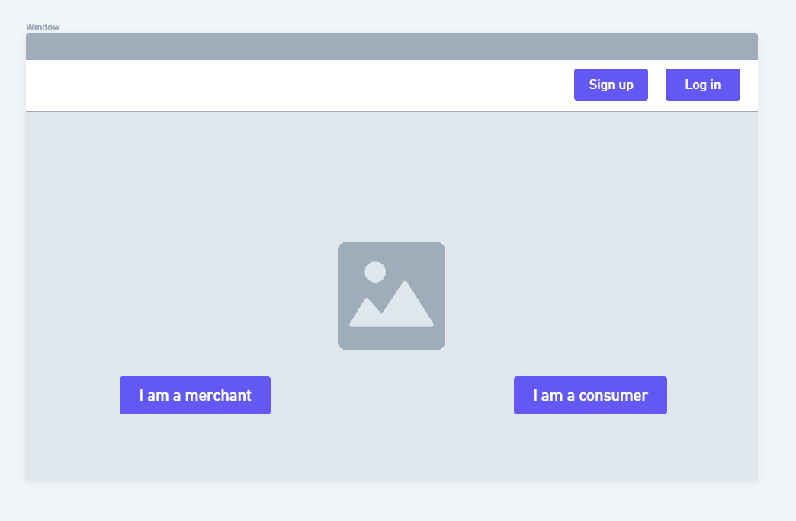

**Log in** 

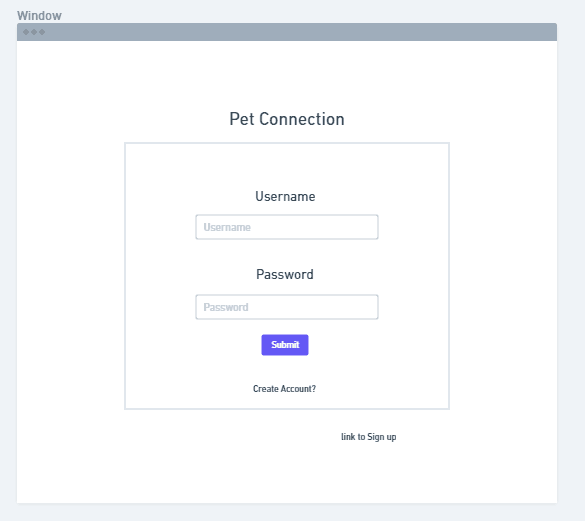

**Sign up** 

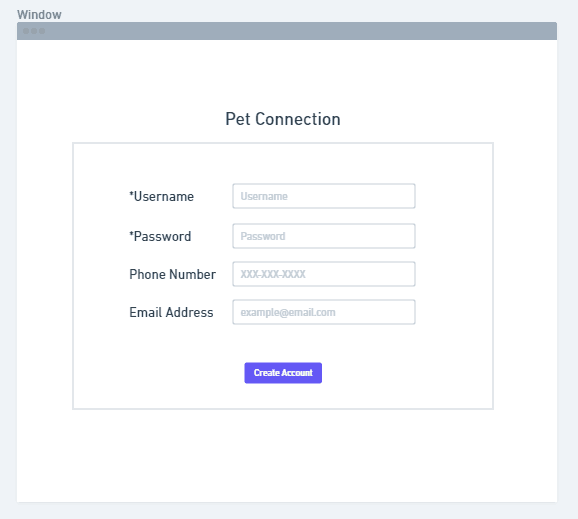

**Personal profile** 

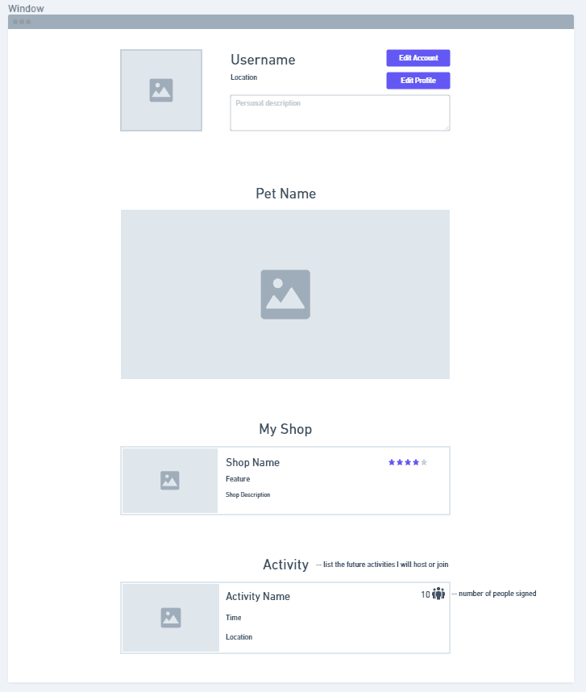

**Consumer view** 

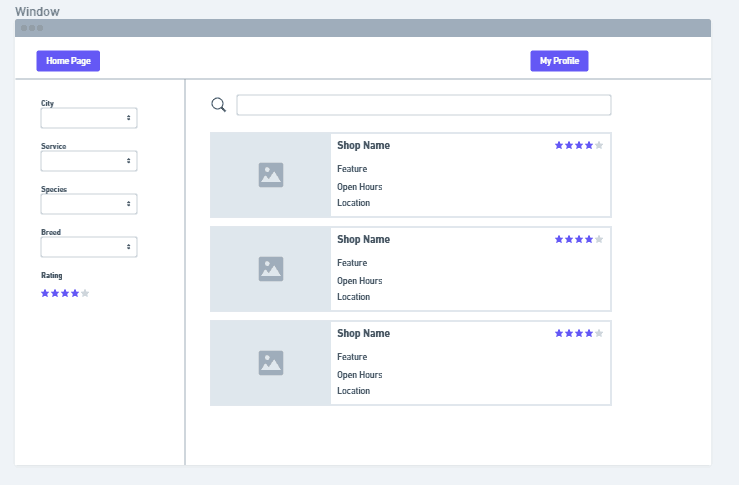

**Shop page** 

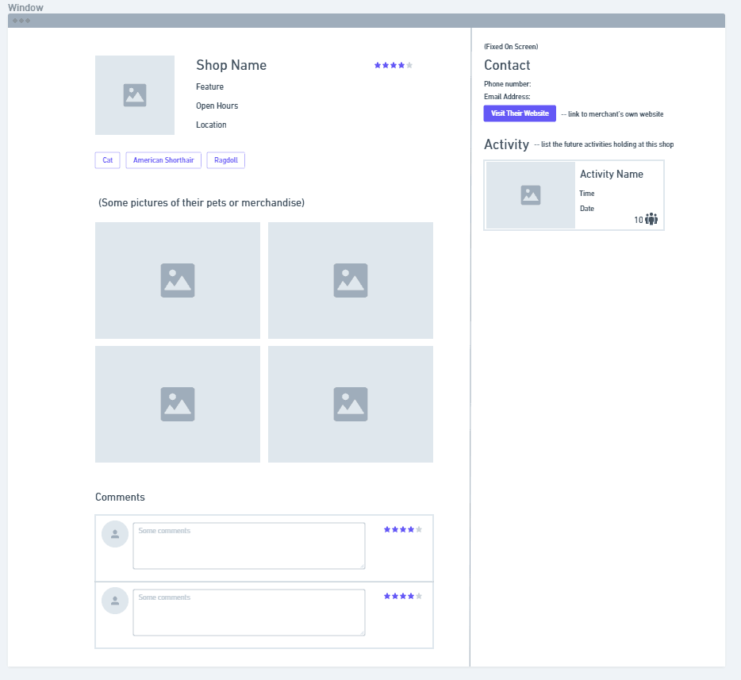

**Shop editting** 

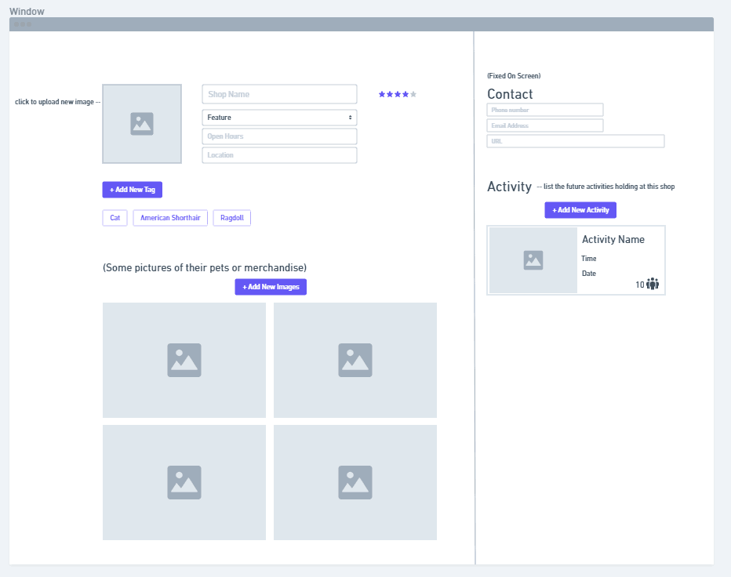

**Activity** 

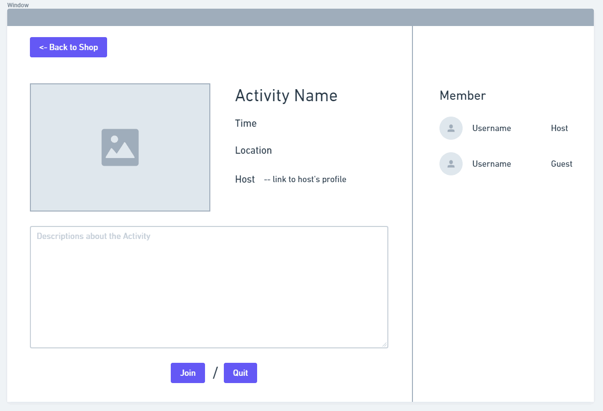

#HTML Screenshot

**This part is done by Chuyang Zhong** 
**Homepage** 
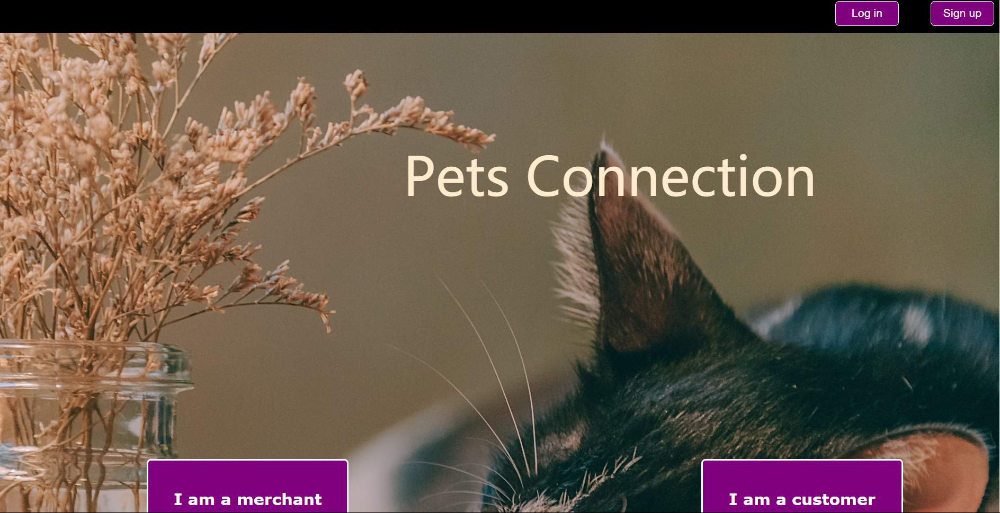
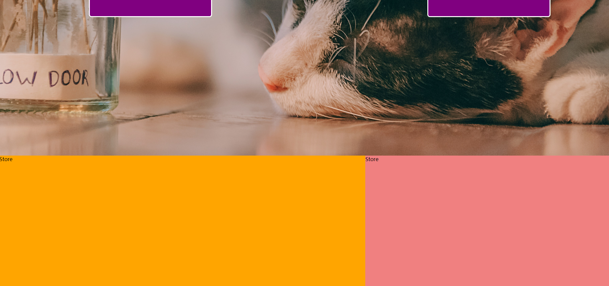

**This part is done by Zhongdong Yu** 
**Log In** 
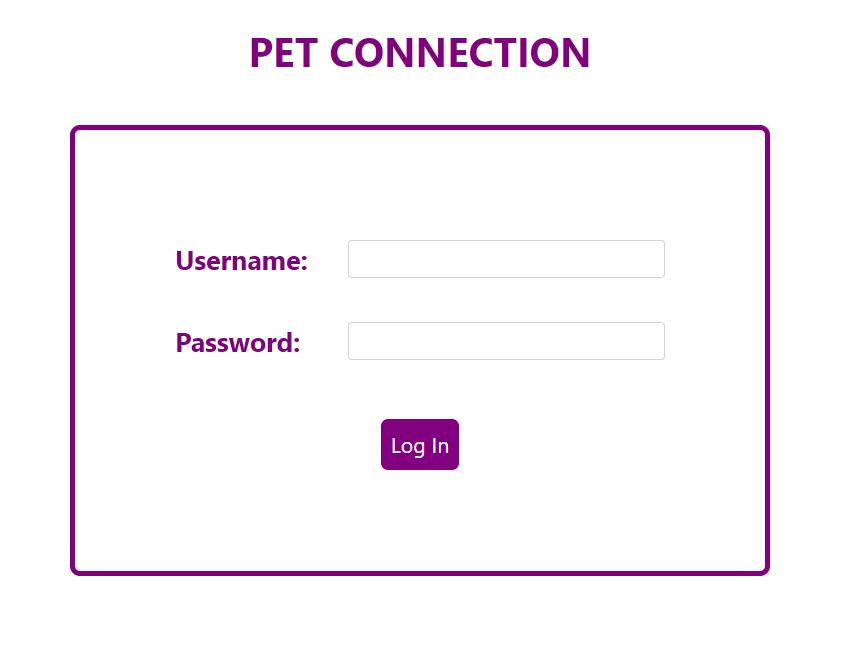

**Sign up** 
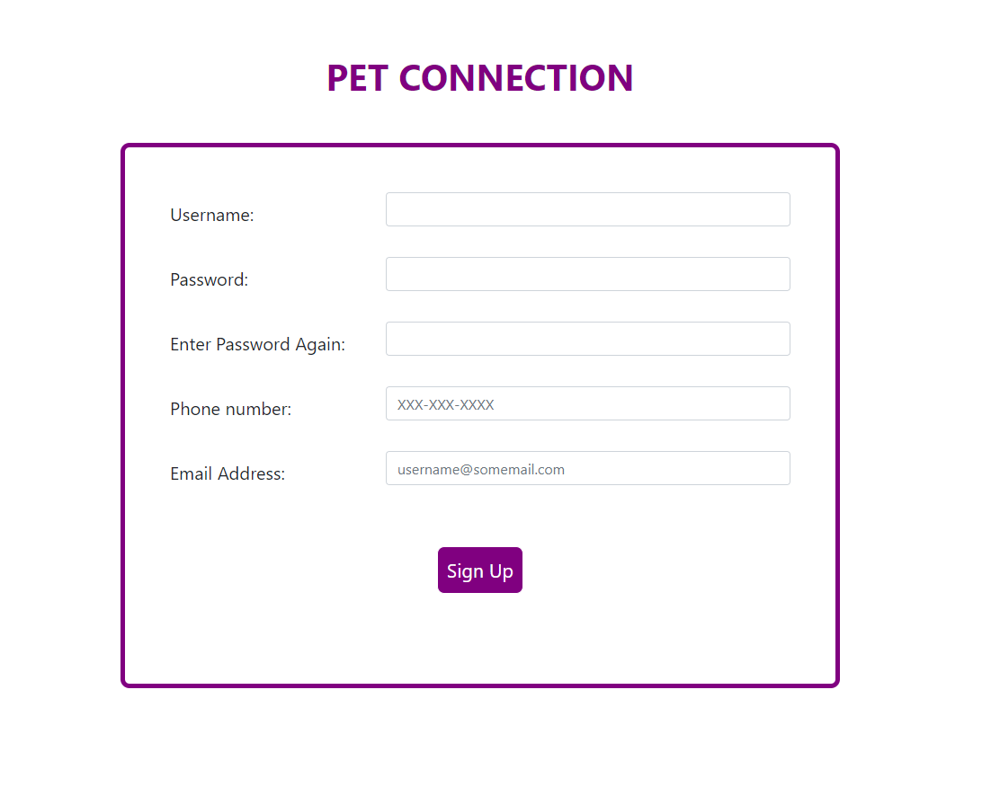

**shop page** 
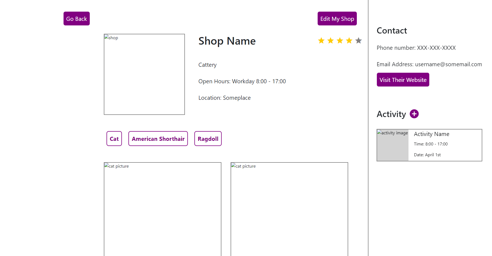
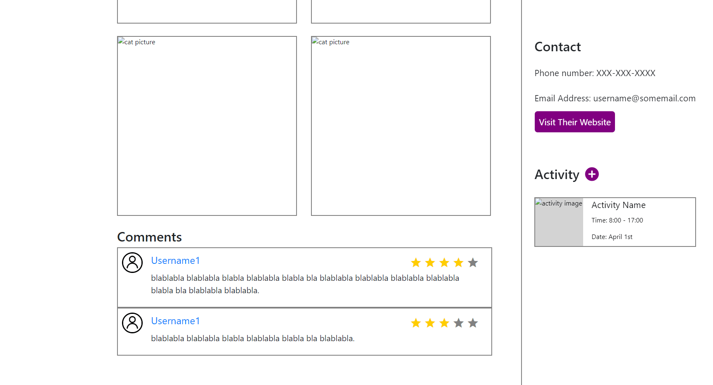

**shop editting page** 
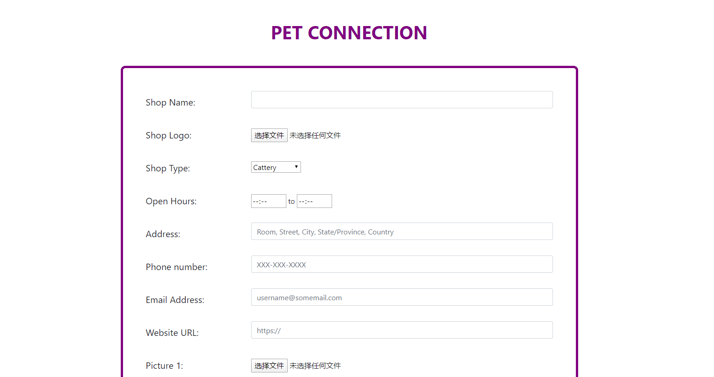
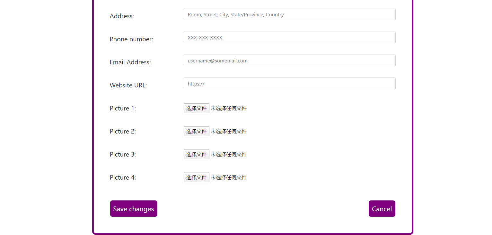

**activity page** 
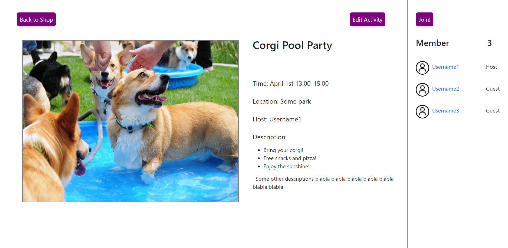

**activity editting page** 
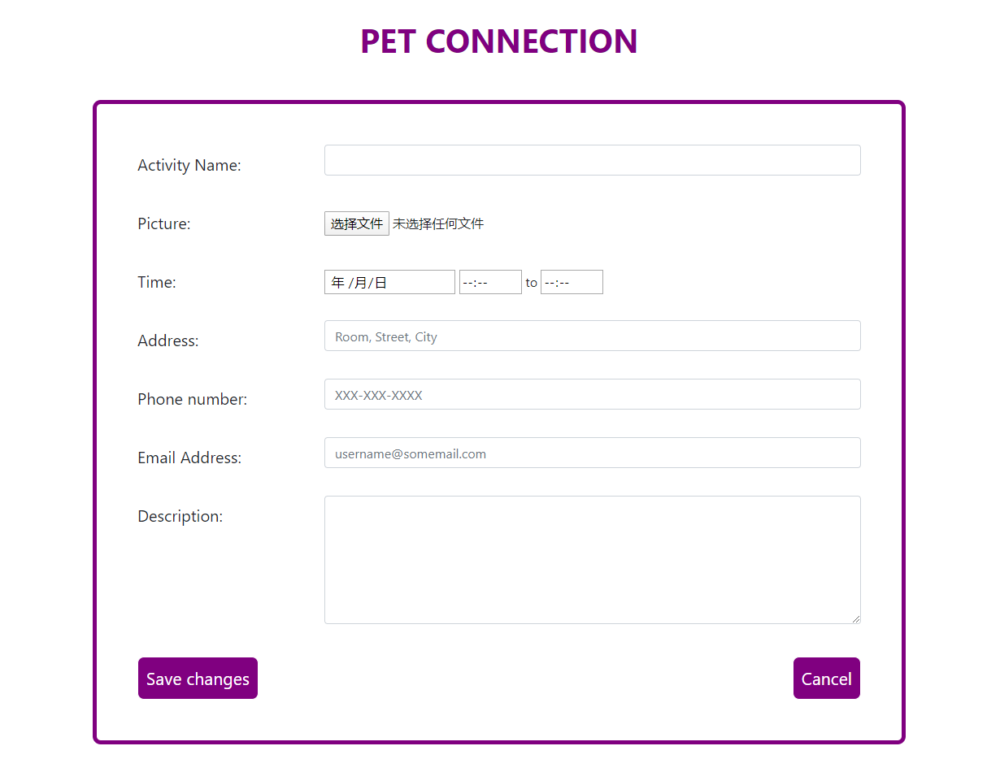
