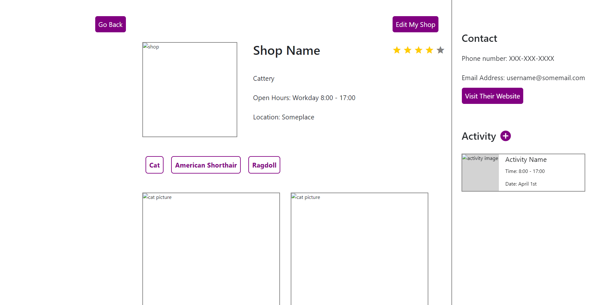
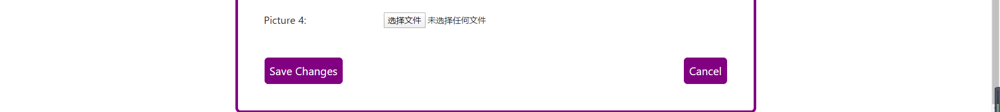

# Group Dalet

# API

/log_in : allows user to log in.

/sign_up : allows user to sign up.

/home : homepage.

/search : allows user to search shops.

/profile : shows user's personal profile.

/profile_edit : allows user to edit his/her personal profile.

/shop : shows a shop's webpage.

/shop_create : allows user to create his/her own shop.

/shop_edit : allows user to edit his/her own shop.

/shop_delete : allows user to delete his/her own shop.

/shop_rate : allows user to rate a shop.

/shop_comment : allows user to comment a shop.

/activity : shows a activity's webpage.

/act_create : allows uer to create an activity.

/act_edit : allows host to edit an activity.

/act_delete : allows host to delete an activity.

/act_join : allows guest to join an activity.

/act_quit : allows guest to quit an activity.

# Screenshots

Take shop as example:

Read:

Create & Update: 
We use the same webpage shop_edit.html to process these two function. 

If the user clicks "Save Changes", then the browser will go back to the shop page, showing one message at bottom "101: shop XXX edited successfully" or "100: shop XXX not found." Else if the user clicks "Cancel", then the browser goes back to the shop page with no message.

Delete: 
Since a shop could only be deleted by its owner, so we decide to add this function in a user's profile. If the user clicks "Delete Shop" then it gives a message "201: XXX's shop is deleted successfully."

# Heroku URL
https://fast-sea-42002.herokuapp.com/

# laber division

Chuyang Zhong - homepage, customer, and heroku deployment

Zhongdong Yu - shop, profile, and heroku deployment

Zhou Xie - shop, activity, and milestone2.md